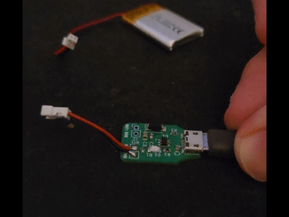
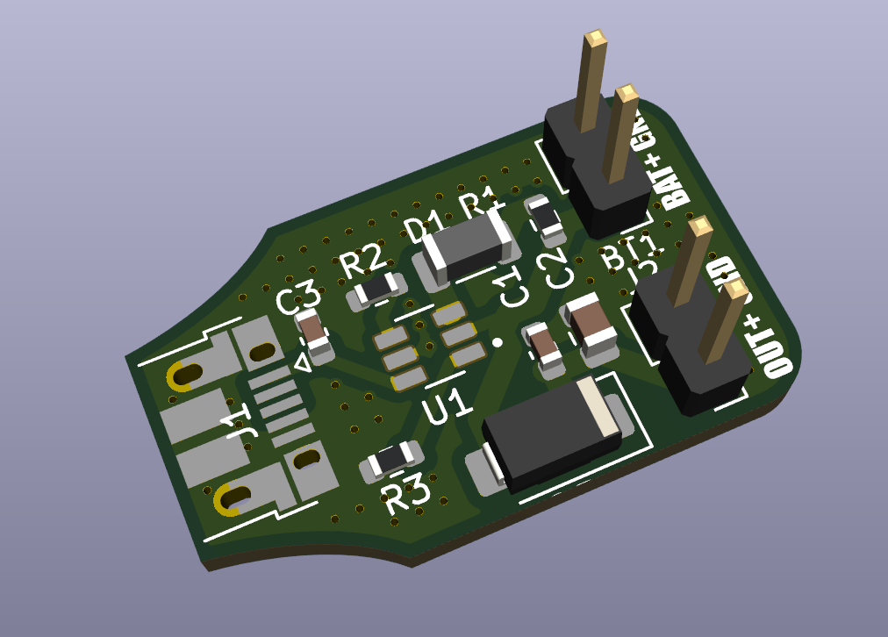

# 1S LiPo/Li-ion BMS (BQ21040DBVT)

This repository contains all the design files for a single-cell (1s) Battery Management System (BMS) for Lithium-Polymer (LiPo) and Lithium-Ion (Li-ion) batteries. The core of this design is the Texas Instruments BQ21040DBVT, a highly integrated battery charger and protection IC.

**400mA output, adjustable via the R2 resistor.**

This BMS is perfect for low-power applications where you need to safely charge and protect a single lithium-based battery cell.

## Features
**Single-Cell Charging**: Safely and efficiently charges a single LiPo or Li-ion cell.

**Over-Charge Protection**: Prevents the battery from being charged beyond its safe voltage limit, extending battery life.

**Over-Discharge Protection**: Stops the battery from being discharged too low, preventing irreversible damage.

**Short-Circuit Protection**: Protects the battery and connected load from damage in the event of a short circuit.

## Repository Contents
**schematic**: Contains the circuit diagram showing the connections for the BQ21040DBVT and all other components.

**pcb**: Includes the Gerber files for the printed circuit board (PCB), ready for manufacturing.

**bom**: A complete Bill of Materials (BOM) listing all the necessary components, along with part numbers and supplier information.

Getting Started
To get started, you can use the Gerber files in the pcb/ folder to have the boards manufactured. Then, use the BOM to order the components and assemble the circuit. The schematic will be your guide during the assembly process.

Disclaimer
This design is provided as-is. While it has been created with careful consideration, it is the user's responsibility to verify its suitability for their specific application. Please refer to the datasheets for the BQ21040DBVT and other components for detailed electrical specifications and safe operating conditions.
